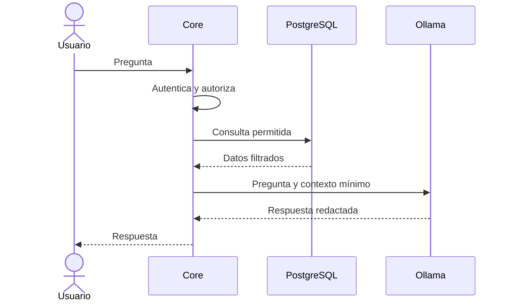

# Arquitectura del asistente IA

**Estado:** diseño conceptual; implementación futura.

Ollama ejecutará un modelo local pequeño configurable. El backend de Spring Boot controla las preguntas admitidas, autentica al usuario, aplica los permisos y proporciona un contexto mínimo. El modelo redacta la respuesta en español; no accede a PostgreSQL, Redis o MongoDB ni ejecuta consultas por iniciativa propia.

Ejemplos de alcance: `USER` consulta sus reservas; `HOTEL_ADMIN` obtiene información de sus hoteles; `SUPER_ADMIN` consulta métricas globales autorizadas. El backend debe impedir filtraciones cruzadas entre usuarios y hoteles.

No se ha fijado aún el modelo concreto. La configuración de URL y nombre del modelo irá en parámetros externos, sin secretos en Git. MongoDB podrá persistir el historial cuando se definan consentimiento, retención y control de acceso. El asistente debe poder informar que no dispone de datos suficientes y la reserva debe funcionar aunque Ollama no esté disponible.
