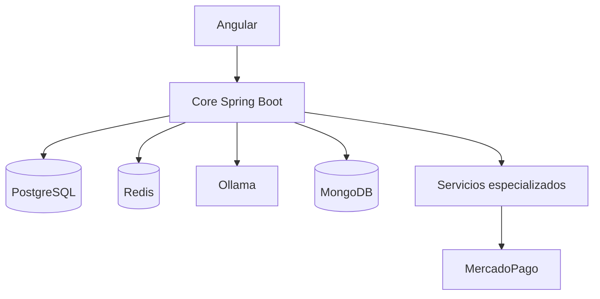

# Arquitectura del sistema

**Estado:** diseño conceptual acordado; contratos técnicos por definir.  
**Actualizado:** 2026-09-27.

Ica Stay es una plataforma de reservas de hoteles orientada inicialmente a Ica. El núcleo del negocio se mantiene en un monolito modular Spring Boot. Tres servicios especializados se incorporarán de forma progresiva.

## Responsabilidades

| Componente | Responsabilidad |
|---|---|
| Angular | Búsqueda, reservas y paneles según rol |
| Core Spring Boot | Autenticación, autorización, usuarios, hoteles, habitaciones, disponibilidad, reservas, dashboards y orquestación de IA |
| PostgreSQL | Datos transaccionales y fuente de verdad |
| Redis | Caché de búsquedas y disponibilidad, con TTL e invalidación por cambios |
| Ollama | Generación local de respuestas; modelo configurable |
| MongoDB | Historial conversacional, cuando se implemente esa etapa |
| payment-service | Integración con MercadoPago y recepción/validación de webhooks |
| billing-service | Generación y gestión de comprobantes; alcance SUNAT pendiente de definir |
| notification-service | Correos de reserva, pago y recordatorios |

Los servicios no comparten escritura directa sobre las tablas del núcleo. Los contratos de API, propiedad de datos, confirmación de pagos, reintentos e idempotencia se definirán en sus specs antes de implementarlos. Redis jamás será la fuente de verdad para confirmar disponibilidad o una reserva.

## Roles y límites

| Rol | Alcance |
|---|---|
| `USER` | Buscar, reservar, consultar y gestionar sus propias reservas; usar asistente |
| `HOTEL_ADMIN` | Gestionar hoteles asignados, habitaciones y reservas de esos hoteles |
| `SUPER_ADMIN` | Administración y métricas globales |

El backend valida tanto el rol como la propiedad del recurso. La autorización no depende de ocultar botones en Angular ni de instrucciones al modelo.

## Flujo principal previsto

1. El usuario consulta disponibilidad.
2. El core verifica la disponibilidad en PostgreSQL al crear una reserva y evita solapamientos mediante una estrategia transaccional aún por definir.
3. Crea una reserva pendiente de pago y solicita iniciar pago a `payment-service`.
4. Tras confirmar el pago por un canal confiable, el core confirma la reserva.
5. Los servicios de comprobantes y notificaciones procesan las acciones correspondientes, con manejo de fallos y reintentos por especificar.

Los pasos 3–5 son diseño objetivo, no funcionalidad implementada.

## Orden de implementación

Documentación y modelo de datos → núcleo con autenticación y flujo de reserva → frontend → Redis → pagos → notificaciones → comprobantes → Ollama → historial MongoDB → pruebas integrales. Mantener un flujo demostrable aun si alguna integración adicional sigue pendiente.

[Notion del proyecto](https://app.notion.com/p/3e82918d49f4817f94f1c329d2ff194f?pvs=204) · [Decisiones](../decisions/architecture-decisions.md)
