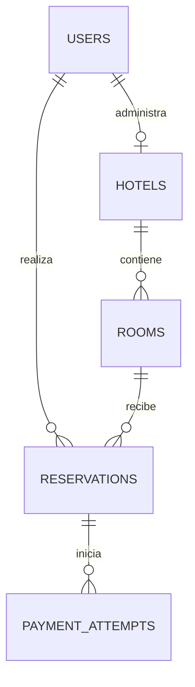

# Modelo entidad–relación de Ica Stay

**Estado:** propuesta técnica inicial para el MVP.  
**Actualizado:** 2026-09-28.

Una reserva corresponde a **una habitación física concreta**, con fechas de ingreso y salida. Un `HOTEL_ADMIN` administra **exactamente un hotel**; un hotel puede tener un administrador en el MVP. No hay asignaciones múltiples.

## Entidades del núcleo (PostgreSQL)

| Entidad | Campos principales | Restricciones |
|---|---|---|
| `users` | `id` UUID, `name`, `email`, `password_hash`, `role`, `status`, `created_at` | `email` único normalizado; `role` ∈ USER/HOTEL_ADMIN/SUPER_ADMIN; contraseña solo como hash |
| `hotels` | `id` UUID, `admin_user_id` UUID, `name`, `description`, `address`, `city`, `status` | FK `admin_user_id → users.id`, único y obligatorio para hotel administrado; el usuario vinculado debe tener rol HOTEL_ADMIN, validado en servicio |
| `rooms` | `id` UUID, `hotel_id` UUID, `number`, `description`, `capacity`, `price_per_night`, `currency`, `status` | FK `hotel_id → hotels.id`; `(hotel_id, number)` único; capacidad y precio positivos; habitaciones inactivas no reservables |
| `reservations` | `id` UUID, `guest_user_id` UUID, `room_id` UUID, `check_in` DATE, `check_out` DATE, `guests` INTEGER, `status`, `expires_at` TIMESTAMPTZ, `nightly_price_snapshot`, `total_amount`, `currency`, `created_at`, `updated_at` | FKs al huésped y habitación; `check_out > check_in`; huéspedes entre 1 y capacidad de habitación; importe no negativo; fecha de salida exclusiva |
| `payment_attempts` | `id` UUID, `reservation_id` UUID, `external_reference`, `provider_payment_id`, `status`, `created_at`, `updated_at` | FK a reserva; referencias externas únicas cuando existan; importe y moneda deben coincidir con reserva; no almacenar tarjetas |

`HOTEL_ADMIN` sin hotel todavía puede existir durante el alta, pero no obtiene permiso sobre ningún hotel. La regla de un solo hotel se impone mediante `UNIQUE(hotels.admin_user_id)`. El core no leerá directamente la base interna del servicio de pagos: `payment_attempts` son referencias y estado de orquestación del core, no la contabilidad completa del proveedor.

## Fechas, precio y disponibilidad

- `check_in` es inclusivo y `check_out` exclusivo: [10, 12) y [12, 14) no se solapan. La interfaz mostrará las fechas en zona `America/Lima`; `expires_at` se almacena como instante UTC.
- Una reserva bloquea la habitación si está `CONFIRMED`, o si está `PENDING_PAYMENT` y `expires_at > now()`. `CANCELLED` y `EXPIRED` no bloquean.
- La disponibilidad es `rooms` activas sin bloqueos solapados en el intervalo solicitado. Buscar disponibilidad puede mostrar un resultado que cambie; la creación vuelve a comprobar.
- El precio por noche y total se copian en la reserva al crearla. El cálculo inicial es precio fijo por habitación × número de noches; precios por fecha, impuestos, descuentos y varias habitaciones por reserva quedan para otra spec.

## Concurrencia y caducidad

Para crear una reserva, el core inicia una transacción, bloquea la fila de la habitación (`SELECT ... FOR UPDATE` o equivalente), verifica bloqueos solapados en PostgreSQL, calcula importe y crea `PENDING_PAYMENT` con `expires_at = hora del servidor + 10 minutos`. Todas las rutas que creen o confirmen una reserva de esa habitación deben seguir el mismo protocolo de bloqueo. `expires_at` nunca se calcula desde el reloj del cliente.

La expiración es lógica desde `expires_at`: una retención vencida deja de bloquear incluso antes de que un proceso periódico cambie su estado a `EXPIRED`. La confirmación de pago vuelve a bloquear y comprobar el estado y la vigencia en una transacción; un evento duplicado no confirma dos veces. Un pago aprobado después de vencer no revive la reserva ni desplaza otra reserva: se registra como incidencia para devolución o revisión según el contrato de pagos que se acuerde. No se debe informar confirmación al huésped antes de resolverla.

## Pendientes de diseño

- Política de cancelación y devolución tras confirmar.
- Información fiscal y alcance real de comprobantes.
- Contrato de idempotencia con `payment-service`, sus webhooks y conciliación.
- Precios variables, fotografías, servicios del hotel y más de una habitación por reserva.

[Spec de reservas](../features/reservations.md) · [API mínima](api.md) · [Notion](https://app.notion.com/p/3e82918d49f4817f94f1c329d2ff194f?pvs=204)
