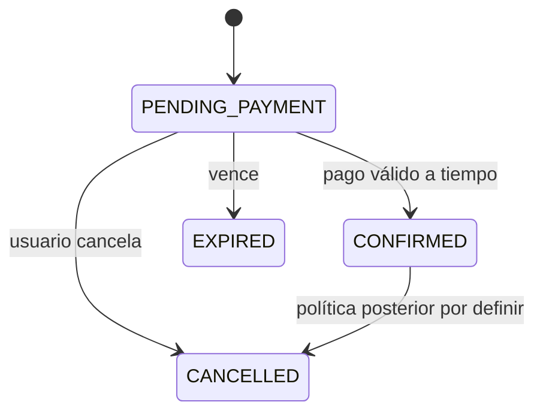

# Reservas de habitación

**Estado:** acordado para diseño MVP; sin implementar.  
**Responsable:** por asignar.  
**Actualizado:** 2026-09-28.

## Objetivo

Un usuario autenticado reserva una habitación específica disponible para un intervalo de noches. El sistema la retiene durante **10 minutos** mientras espera el pago.

## Actores y permisos

| Actor | Capacidad | Alcance |
|---|---|---|
| `USER` | Crear, consultar y cancelar reserva pendiente; consultar sus reservas | Solo propias |
| `HOTEL_ADMIN` | Consultar reservas de su hotel | Solo hotel cuyo `admin_user_id` coincide con su identidad |
| `SUPER_ADMIN` | Consultar reservas globales | Plataforma |

Los permisos se verifican en el backend al consultar cada ID; el cliente no suministra `guest_user_id` ni puede escoger propietario.

## Flujo principal

1. `USER` consulta habitaciones disponibles indicando ingreso, salida y huéspedes.
2. Elige una habitación física y solicita reservarla.
3. El core verifica identidad, fechas futuras, capacidad, estado de la habitación y disponibilidad bajo bloqueo transaccional.
4. El core calcula y guarda precio total y crea `PENDING_PAYMENT` con vencimiento en 10 minutos.
5. Se devuelve `reservationId`, `expiresAt`, importe y estado; en una etapa posterior se inicia el pago mediante `payment-service`.
6. Cuando el servicio de pagos verifique la aprobación por un canal confiable, el core revalida la vigencia y confirma la reserva una sola vez.

## Estados y transiciones

`EXPIRED` puede ser estado lógico calculado por fecha antes de persistirse. Cancelar `CONFIRMED` queda fuera del primer incremento hasta definir devolución. `COMPLETED` puede agregarse cuando exista gestión de estadía.

## Alternativas y errores

- Fecha de salida igual/anterior al ingreso, fecha pasada, cantidad de huéspedes inválida o superior a capacidad → `400`.
- Habitación inexistente → `404`; inactiva u ocupada → `409`.
- Dos solicitudes concurrentes para la misma habitación y fechas → a lo sumo una retención activa; la otra recibe `409`.
- Si la retención vence, ya no impide otra reserva, aunque el job de limpieza no haya corrido.
- Pago fallido → permanece pendiente hasta vencer o puede cancelarse explícitamente; el estado externo no equivale a confirmación.
- Pago tardío o repetido → no confirmar una reserva vencida/cancelada ni crear una nueva; registrar incidencia y conciliar posible devolución.
- Falla del servicio de pagos → mantener reserva pendiente hasta el vencimiento, informar que el inicio de pago no está disponible; evitar estados confirmados sin prueba de pago.
- Acceso a reserva ajena o de otro hotel → `403` (sin exponer detalles privados).

## Datos y contratos

`reservations`: `id`, `guest_user_id`, `room_id`, `check_in`, `check_out`, `guests`, `status`, `expires_at`, `nightly_price_snapshot`, `total_amount`, `currency`, fechas de auditoría. Referencia de pago separada. Ver [modelo ER](../architecture/database.md) y [API mínima](../architecture/api.md).

Las fechas de estancia usan `YYYY-MM-DD`, fin exclusivo; `expiresAt` es timestamp con zona, serializado en ISO 8601. `guest_user_id` se deriva del token. El servidor calcula precio y caducidad; no acepta esos valores desde el cuerpo de la solicitud.

## Estados de interfaz

Mostrar búsqueda/carga, habitaciones sin resultados, disponibilidad cambiada (`409`), reserva pendiente con contador basado en `expiresAt`, expiración, confirmación y fallo recuperable del pago. El contador visual no reemplaza la validación del servidor.

## Criterios de aceptación

- [ ] Una reserva válida retiene una habitación concreta por 10 minutos y devuelve fecha exacta de vencimiento.
- [ ] Una segunda reserva solapada no puede crearse mientras la primera esté activa, incluso con solicitudes concurrentes.
- [ ] Un intervalo que comienza en `check_out` de otra reserva no se considera solapado.
- [ ] Vencida la retención, vuelve a aparecer disponible aunque no se haya ejecutado limpieza.
- [ ] Un `USER` solo ve sus reservas y un `HOTEL_ADMIN` solo las de su hotel; `SUPER_ADMIN` ve todas.
- [ ] Un pago tardío o duplicado no produce confirmaciones erróneas.
- [ ] Se conservan importe, moneda y precio por noche al momento de crear la reserva.

## Primer incremento y pendientes

Primer incremento implementable: disponibilidad, creación y consulta de reservas, retención, expiración y cancelación de pendientes. Integración real de MercadoPago, confirmación, políticas de reembolso y facturación se desarrollan en etapas posteriores; para probar la transición a `CONFIRMED` se empleará una prueba de integración del core, sin endpoint público que simule pago.

[Notion](https://app.notion.com/p/3e82918d49f4817f94f1c329d2ff194f?pvs=204) · [Decisiones](../decisions/architecture-decisions.md)
